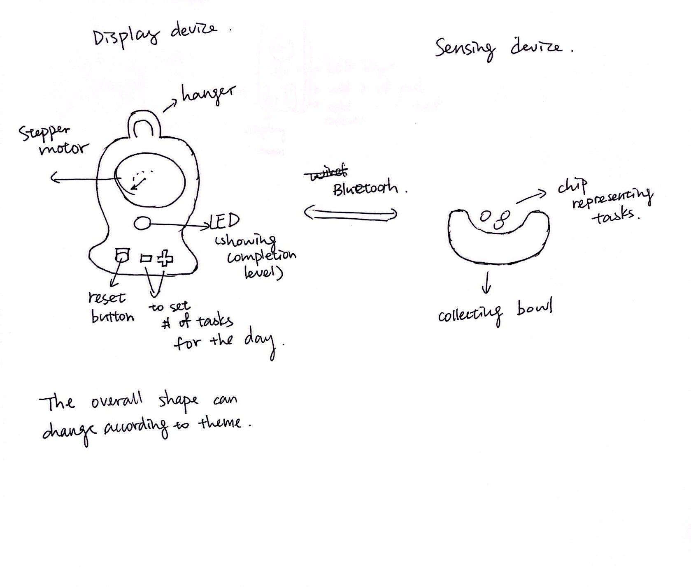
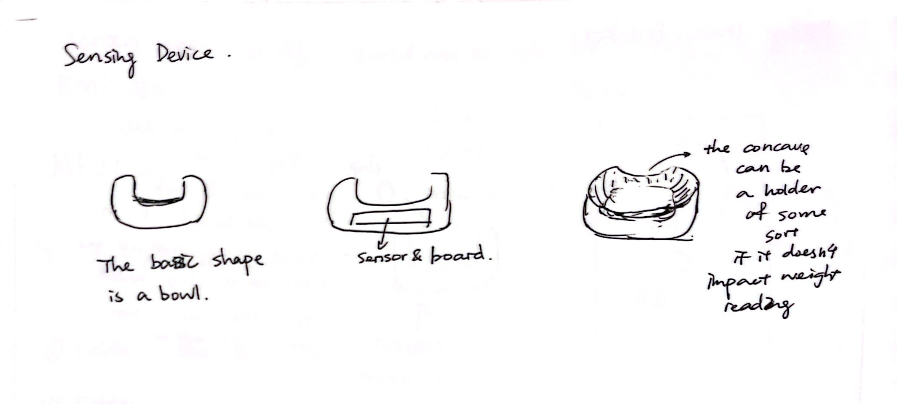
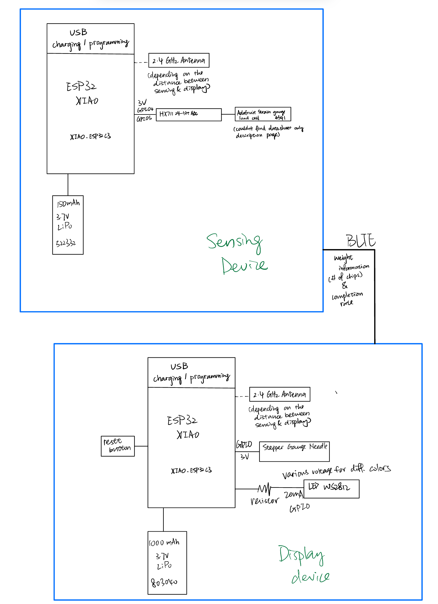

# TECHIN514-final

## Daily Habit Tracker
The device tracks the number of task completed (chips in the collector/sensing device) and show the progress with the stepper gauge needle. The LED light can be on the scale of red to green based on percentage of completion. It relies on the load cell and amplifier to calculate the number of chips of completed tasks and completion rate based on the set goal of the day. The stepper motor gauge and LED will display the progress. The display device also have the option to set the goals.

## Sensor device
The sensor device looks like a bowl overall. There is a load cell and amplifier that read the weight and translate it to voltage. It calculates the percentage of task completion and send the data to display device for further information display.

## Display Device
The outer shape can be varied based on the final PCB shape and size. The diplay has a stepper motor gauge and LED light both shows the completion rate of the task in different forms. It has a reset button and button to adjust the goal of the day.

## Device Communicatioin 

